# Lab 3 Report: Programmation des RDDs avec Spark

Repository: https://github.com/OussamaKhouya/rdd-spark.git

## 1. Introduction
This report summarizes the implementation and results of RDD-based data processing with Spark in Java. Two exercises are covered: sales aggregation and log analysis.

## 2. Objectives
- Build Spark applications using RDD transformations and actions.
- Aggregate sales totals by city and by city/year.
- Parse Apache logs and compute basic statistics and rankings.

## 3. Data Sources
- `ventes.txt` (sales records in the form: `date ville produit prix`)
- `data/access.log` (Apache-style web server logs)

## 4. Exercise 1: Sales Aggregation

### 4.1 Total Sales by City
Goal: compute total sales per city from `ventes.txt`.

Method (RDD):
- `textFile` -> `split`
- map to `(ville, prix)`
- `reduceByKey(sum)`

Implementation: `src/main/java/ma/enset/bigdata/rdd/VentesTotalParVille.java`

Evidence:

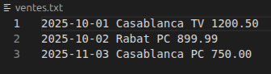
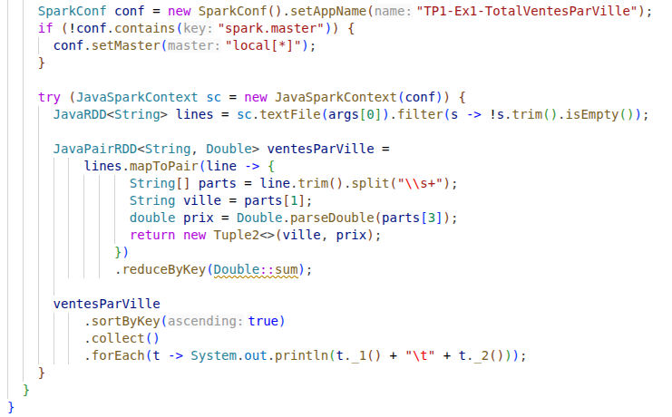
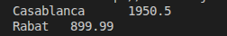

### 4.2 Total Sales by City and Year
Goal: compute total sales per city per year.

Method (RDD):
- extract `annee` from `date`
- key = `(ville, annee)`
- `reduceByKey(sum)`

Implementation: `src/main/java/ma/enset/bigdata/rdd/VentesTotalParVilleParAnnee.java`

Evidence:

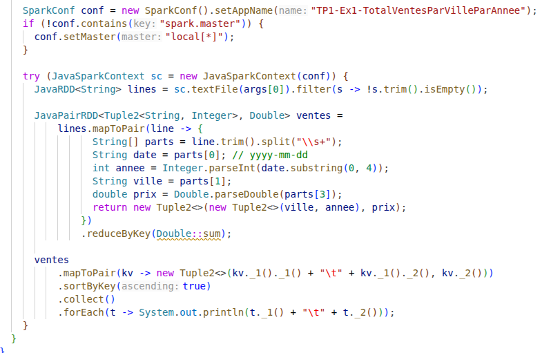
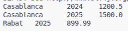
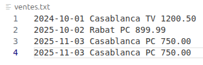

## 5. Exercise 2: Log Analysis with RDD in Java

### 5.1 Load Logs
Goal: read `data/access.log` into an RDD.

Evidence:

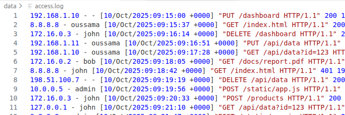
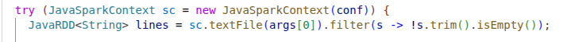

### 5.2 Parse Fields
Goal: extract IP, date/time, method, resource, status, and size.

Method:
- Apache log regex parsing
- Map into `LogEntry` (getters: `ip`, `dateTimeRaw`, `method`, `resource`, `status`, `size`)

Evidence:

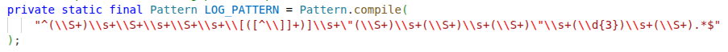
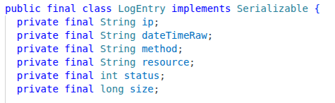
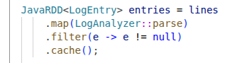

### 5.3 Basic Statistics
Goal:
- total requests
- total errors (HTTP >= 400)
- error percentage

Evidence:

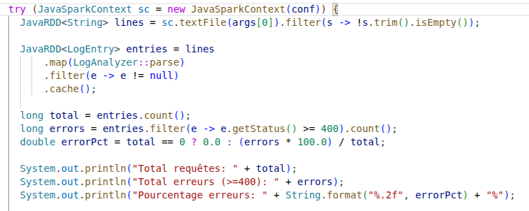
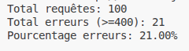

### 5.4 Top 5 IPs by Request Count
Method:
- `mapToPair(ip, 1)`
- `reduceByKey(sum)`
- `takeOrdered(5, comparatorDescCount)`

Evidence:

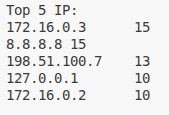

### 5.5 Top 5 Resources by Request Count
Method:
- `mapToPair(resource, 1)`
- `reduceByKey(sum)`
- `takeOrdered(5, comparatorDescCount)`

Evidence:

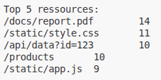

### 5.6 Requests by HTTP Status Code
Method:
- `mapToPair(status, 1)`
- `reduceByKey(sum)`
- `sortByKey`

Evidence:

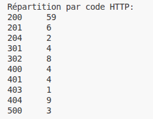

## 6. Conclusion
The Spark RDD applications successfully aggregated sales data and analyzed web logs using standard transformations and actions. The results are validated by the included screenshots of code and outputs.
